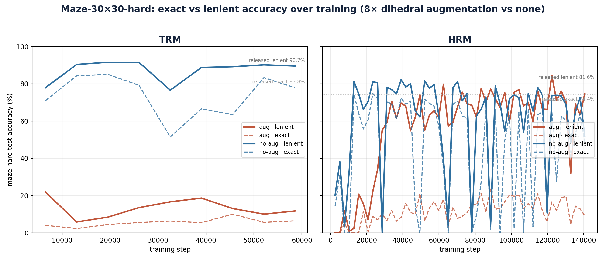

# Maze-Hard reproductions: HRM & TRM, with lenient evaluation

Independent reproductions of **HRM** ([sapientinc/HRM](https://github.com/sapientinc/HRM))
and **TRM** ([alphaXiv/TinyRecursiveModels](https://github.com/alphaXiv/TinyRecursiveModels))
on **Maze-30×30-hard**, re-evaluated with a *lenient* metric and trained with/without
augmentation. Runs on [Modal](https://modal.com/) (B200 train, H100 eval); the
external repos are cloned at image-build time (nothing vendored/forked).

## Why re-evaluate

The HRM paper's stated maze-hard correctness criterion is that a path is correct
if it is **valid and optimal**. But for the model comparison the reported numbers
use **exact match** against the single shortest path produced by their
(deterministic) A\* solver. Two reasons that's worth revisiting:

1. **Exact match is too strict for mazes.** A 30×30 maze has many shortest paths;
   the interesting question is whether the model finds *any* valid optimal
   solution, not whether it reproduces A\*'s particular one. So we add a
   **lenient** score: a prediction is correct if its marked path cells form a
   valid simple start→goal path whose length equals the maze's BFS-optimal
   length — i.e. any optimal path counts.
2. **TRM's augmentation claim.** The TRM paper states training used data
   augmentation, but the code (maze builder defaults to no augmentation) and our
   results (augmentation underperforms / changes behaviour) suggest the released
   maze model was trained **without** it. So we train both ways and compare.

## Quick start
```bash
modal token new                                                # one-time
modal secret create huggingface-secret HF_TOKEN=<your HF token>
modal secret create wandb-secret WANDB_API_KEY=<your W&B key>  # training logs to W&B

# Eval the RELEASED checkpoints (no training needed):
uv run modal run repro/hrm_eval/modal_eval.py::main    # HRM
uv run modal run repro/trm_eval/modal_eval.py::main    # TRM

# Augmentation study (each train script ~24h on a B200):
./repro/train_with_aug.sh  &&  ./repro/eval_with_aug.sh
./repro/train_no_aug.sh    &&  ./repro/eval_no_aug.sh   # the eval scripts also plot
```

Training streams to **Weights & Biases** (online via `wandb-secret`) and writes a
persistent `<run_name>.train.log` to the checkpoint volume. Eval sweeps + plots
land in `repro/results/` (committed once runs complete).

## Results — released checkpoints, full 1,000-puzzle test set
| model | params | exact | lenient (any optimal path) |
|---|---|---|---|
| HRM | 27M | 74.4% | **81.6%** |
| TRM | 7M  | 83.8% | **90.7%** |

Exact-match understates both by ~7 points — they routinely find a valid optimal
path that simply isn't A\*'s labelled one.

> The TRM checkpoint is an **independent reproduction** by alphaXiv
> ([`alphaXiv/trm-model-maze`](https://huggingface.co/alphaXiv/trm-model-maze),
> file `maze_hard_step_32550`), *not* original-author weights. The HRM checkpoint
> is the authors' own release
> ([`sapientinc/HRM-checkpoint-maze-30x30-hard`](https://huggingface.co/sapientinc/HRM-checkpoint-maze-30x30-hard)).

## Findings

**1. The paper numbers reproduce.** Re-training from scratch *without* augmentation
matches the papers' reported maze-hard exact-match accuracy, and evaluating the
released checkpoints agrees:

| model | best exact (ours) | paper exact | released-ckpt exact | best lenient (ours) |
|---|---|---|---|---|
| TRM (7M)  | 85.1% | 85.3% | 83.8% | 91.6% |
| HRM (27M) | 74.8% | 74.5% | 74.4% | 82.2% |

**2. 8× dihedral augmentation hurts TRM, and helps HRM only on long runs (lenient
only).** Best performance reached over each training trajectory:

| model | training | best exact | best lenient |
|---|---|---|---|
| TRM | no-aug | **85.1%** | **91.6%** |
| TRM | aug | 10.1% | 22.0% |
| HRM | no-aug | **74.8%** | 82.2% |
| HRM | aug | 23.6% | **84.6%** |

- **TRM (7M):** augmentation is catastrophic — best lenient 22% vs 92% no-aug. The
  tiny model destabilises under the 8× more varied data.
- **HRM (27M):** augmentation *tanks exact* (24% vs 75%) because it decorrelates the
  model from the dataset's single canonical A\* path — but its best *lenient* (84.6%,
  reached only after ~120k steps) edges out no-aug (82.2%). So augmentation helps HRM
  **only** on the any-optimal-path metric and **only** with long training.

HRM training is noisy under constant LR, so these are best-over-trajectory; the full
curves are below.



## Steady-state training throughput (single B200, global batch 768)
For compute-matched comparisons later. Per-step cost is independent of
augmentation (same model/batch); total steps = `epochs × 1.302`.

| model | s / step | steps / s |
|---|---|---|
| TRM (7M) | ~1.46 | ~0.68 |
| HRM (27M) | ~0.61 | ~1.64 |
